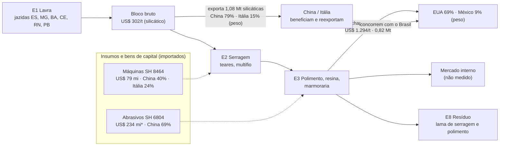

# Mapeamento da cadeia produtiva e da cadeia de valor das rochas ornamentais brasileiras — versão 1

**Data-base:** 10/10/2026 · **Dados:** ComexStat até set/2026, UN Comtrade até 2025 · **Tabelas de apoio:**
[anexo-estatistico.md](anexo-estatistico.md) (regenerado todo mês pelo robô)

> **Status desta versão.** Os números de comércio exterior estão validados contra os Informes Abirochas
> (diferença de 0,1–0,2%). A literatura citada vem do núcleo Brasil do corpus **ainda não triado** (2.230 obras);
> nenhuma afirmação aqui depende de uma obra específica. Interpretações marcadas como **hipótese** pedem
> confirmação com fonte primária ou entrevista antes de publicação.

---

## Sumário executivo

1. **O setor exporta US$ 1,475 bilhão (2025, recorde nominal) e 2,11 milhões de toneladas.** O volume está
   22% abaixo do pico de 2013 (2,72 Mt); o valor cresce por preço, não por quantidade.
2. **A cadeia é de valor dual.** 72% do valor sai como produto beneficiado (chapas, ladrilhos), vendido a
   US$ 1.294/t; o bloco bruto silicático sai a US$ 302/t. O mesmo material vale **4,3 vezes mais** depois de
   serrado e polido no Brasil.
3. **Dois mercados, dois produtos, dois papéis.** Os EUA compram 69% do peso das beneficiadas: o Brasil é
   fornecedor final. A China compra 79% dos blocos silicáticos e 89% dos carbonáticos: o Brasil é fornecedor de
   matéria-prima para o seu concorrente no mercado americano.
4. **Dependência extrema de um destino.** EUA = 53,9% do valor exportado em 2025; HHI dos destinos = 3.290
   (mercado altamente concentrado). O choque de agosto de 2025 mostra o risco: a participação americana caiu de
   58% (jul) para 37% (ago) num único mês.
5. **Concentração territorial crescente.** O Espírito Santo passou de 44% (2000) para **84%** (2025) do valor
   exportado; Minas Gerais caiu de 28% para 9%. A cadeia nacional é, na prática, a cadeia capixaba.
6. **O Brasil lidera o mercado americano de beneficiadas** (27,0% em 2025, à frente de Itália 20,6%, Turquia
   14,3%, Índia 10,9%, China 10,2%), mas **recebe metade do preço italiano** por tonelada (US$ 1.088 vs 2.027 em
   2024).
7. **Os bens de capital e insumos vêm de fora.** Máquinas para trabalhar pedra (SH 8464): 40% China, 24% Itália.
   Abrasivos (SH 6804): 69% China. O elo de equipamentos da cadeia não é brasileiro.

---

## 1. Escopo, fontes e método

**Objeto.** Rochas ornamentais e de revestimento: mármores, granitos e demais silicáticas, quartzitos, ardósias,
em bloco, chapa ou obra acabada. Recorte por NCM (capítulos 25.14–25.16, 2506.20 e 68.01–68.03), validado contra a
Abirochas.

**Fontes.** ComexStat/MDIC (exportação e importação mensal por produto, país e UF, 1997–2026); UN Comtrade
(exportação dos 10 maiores concorrentes e importações dos EUA por origem, 2000–2025); BCB (câmbio, IPCA); corpus
bibliográfico de 7.267 obras (OpenAlex, Crossref, BDTD), das quais 2.230 de escopo brasileiro; varredura diária de
notícias. Coleta automatizada e auditável no repositório.

**Método.** A cadeia é decomposta em 11 elos (lavra → beneficiamento primário → beneficiamento final → insumos →
logística → comercialização → mercado consumidor → resíduos → trabalho → governança → tecnologia). Para cada
elo: o que os dados medem, o que a literatura cobre e o que falta. Valores em US$ correntes FOB.

**O que este estudo não mede (ainda).** Produção física interna, mercado doméstico, emprego, margens e custos por
elo. A cadeia de valor aqui é inferida pelo **preço por tonelada em cada estágio do comércio exterior** — uma
aproximação legítima para um setor exportador, mas não substitui dados de custo (seção 9).

---

## 2. Mapa da cadeia produtiva

_\* SH 6804 inclui abrasivos de outros setores; valor é teto, não gasto do setor._

---

## 3. Os elos com números

### E1–E2 · Lavra e bloco bruto
- **Exportação de brutos (2025):** silicáticos US$ 325 mi / 1,08 Mt (US$ 302/t); carbonáticos (mármore)
  US$ 37 mi / 0,10 Mt; ardósia US$ 50 mi.
- **Destino do bloco:** China absorve 79% do peso silicático e 89% do carbonático; Itália 15% e 7%.
- **Quartzito é o produto em ascensão:** exportação em bloco/placa bruta (NCM 2506.20) passou de US$ 7 mi
  (2007) para **US$ 144 mi (2025)**, 20 vezes em 18 anos.
- **Lacuna:** produção física por substância e município (ANM/AMB, CFEM) — não incorporada (seção 9).

### E3 · Beneficiamento final
- **Exportação de beneficiadas (2025):** US$ 1.063 mi / 0,82 Mt (US$ 1.294/t), 72% do valor exportado.
- **Preço por tonelada subiu 61% entre 2021 e 2025** (US$ 803 → 1.294) enquanto o peso caiu 35%
  (1,27 → 0,82 Mt). **Hipótese:** mudança de mix para chapas de quartzito e materiais exóticos de maior valor,
  e saída de produtos de menor valor (ladrilhos, pavimentos). Os dados de NCM agregada não separam efeito
  preço de efeito mix; a série por NCM de 8 dígitos (anexo, `comex_export_ncm`) permite testar.

### E4 · Insumos e bens de capital
- Importação de máquinas (SH 8464) oscila com o ciclo de investimento: US$ 20 mi (2005), 56 mi (2010), 35 mi
  (2020), 79 mi (2025). **Troca de fornecedor:** Itália caiu de 67% (2000) e 53% (2010) para 24% (2025); China
  subiu de 16% (2010) para 40%.
- Abrasivos (SH 6804) dobraram (US$ 105 mi em 2010 → 234 mi em 2025), China de 30% para 69%.
- **Leitura:** o elo de tecnologia de processo é importado, e a dependência migrou da Itália para a China.
  Proxy imperfeita (ver nota no anexo A5).

### E6 · Comercialização e exportação
- 132 países de destino em 2025, mas **HHI 3.290**: EUA 53,9%, China 17,2%, Itália 7,8%, México 3,7%.
- **Choque de 2025:** a participação dos EUA caiu de 58% (jul/2025) para 37% (ago/2025) e 45% (set). O total
  exportado no mês caiu de US$ 147 mi para 97 mi. A queda coincide com a entrada em vigor da tarifa adicional
  americana sobre produtos brasileiros, registrada no noticiário coletado (ex.: Diário do Nordeste, 03/10/2026).
  Em 2026 a participação oscila entre 39% e 58%, sem tendência clara de recuperação ao patamar anterior
  (~58–62%). **A confirmar:** alíquota e exceções aplicáveis às NCMs do setor.
- Ainda assim, o acumulado de 12 meses até set/2026 é US$ 1,462 bi (+2,0%): **outros destinos compensaram
  parcialmente** — hipótese a testar no anexo A2/A3.

### E7 · Mercado consumidor (EUA)
- Mercado americano de beneficiadas: ~US$ 3,1 bi/ano, estável desde 2015.
- **O Brasil é o maior fornecedor desde ~2010** (17,6% em 2005 → 27,0% em 2025). A China perdeu metade da
  participação desde 2015 (20,3% → 10,2%); a Itália recuperou (14,1% em 2020 → 20,6% em 2025).

### E5, E9, E10, E8 · Logística, trabalho, governança, resíduos
- **Sem dado quantitativo incorporado.** Literatura existe: resíduos é o tema mais estudado no núcleo Brasil
  (1.407 obras), logística o menos (66). Ver seção 7.

---

## 4. Cadeia de valor: onde o valor é capturado

| Estágio | Quem faz | US$/t (referência) | Fonte |
|---|---|---|---|
| Bloco silicático exportado | Brasil → China/Itália | 302 (2025) | ComexStat |
| Chapa/obra exportada pelo Brasil | Brasil → EUA | 1.294 (2025); 1.088 (2024, Comtrade) | ComexStat/Comtrade |
| Beneficiada exportada pela China | China → mundo | 818 (2024) | Comtrade |
| Beneficiada exportada pela Itália | Itália → mundo | 2.027 (2024) | Comtrade |

**Três achados:**

1. **Beneficiar no Brasil multiplica o valor por ~4.** A política de agregação de valor do setor (exportar chapa,
   não bloco) está parcialmente realizada: 72% do valor já é beneficiado, mas 56% do **peso** exportado ainda sai
   como bloco (1,18 Mt de 2,11 Mt, 2025).
2. **A Itália compra bloco brasileiro e vende produto acabado ao dobro do preço brasileiro.** Itália importa 15%
   dos blocos silicáticos brasileiros e exporta beneficiadas a US$ 2.027/t. **Hipótese:** o diferencial vem de
   marca, design, distribuição e mix (mármores e obras de alto valor), não de transformação física — é o elo de
   comercialização/marca que captura valor, não o de serragem.
3. **O Brasil alimenta o próprio concorrente.** A China compra ~80% dos blocos brasileiros e compete com o Brasil
   no mercado americano. A perda de participação chinesa nos EUA (2015–2025) abriu espaço que o Brasil ocupou.

---

## 5. Polos produtores

| UF | 2000 | 2010 | 2025 |
|---|---|---|---|
| Espírito Santo | 43,6% | 71,5% | **84,1%** |
| Minas Gerais | 27,5% | 19,7% | 9,2% |
| Ceará | — | 1,5% | 2,4% |
| Bahia | 6,5% | 1,2% | 1,2% |
| Rio Grande do Norte | — | — | 1,1% |
| Rio de Janeiro | 8,2% | 1,1% | <1% |

**Ressalva crítica:** UF de exportação ≠ UF de lavra. Blocos de MG, BA e do Nordeste são beneficiados e
exportados pelo ES (Cachoeiro de Itapemirim, Serra, Nova Venécia) e pelo porto de Vitória. A concentração em
84% mede **onde se beneficia e exporta**, não onde se extrai. A geografia da lavra exige CFEM/SIGMINE (seção 9).

---

## 6. Evolução 1997–2026

| Fase | Período | Exportação (US$ mi) | Marca |
|---|---|---|---|
| Arranque | 1997–2000 | 195 → 265 | setor pequeno, mais de 70% beneficiado |
| Expansão | 2000–2008 | 265 → 953 | preço da beneficiada triplica (284 → 786 US$/t) |
| Crise | 2009 | 723 (−24%) | colapso imobiliário nos EUA |
| Pico de volume | 2011–2014 | 998 → 1.301 (2013) | 2,72 Mt em 2013, máximo histórico |
| Estagnação | 2015–2020 | 1.208 → 987 | volume e preço em queda |
| Recuperação por preço | 2021–2025 | 1.336 → 1.475 | volume cai, preço/t sobe 61% |
| Choque tarifário | ago/2025– | 12 m: 1.462 (+2,0%) | participação dos EUA instável |

---

## 7. O que a literatura brasileira cobre (corpus não triado)

2.230 obras de escopo brasileiro; produção concentrada a partir dos anos 2000 (405 obras) e 2010 (973).

| Elo | Obras | Leitura |
|---|---|---|
| Resíduos/ambiente | 1.407 | tema dominante: reaproveitamento da lama de beneficiamento |
| Tecnologia | 929 | caracterização tecnológica de rochas |
| Lavra | 781 | geologia aplicada, métodos de lavra |
| Mercado/construção | 766 | — |
| Comércio/exportação | 632 | — |
| Beneficiamento final | 488 | — |
| Trabalho/saúde | 312 | silicose, acidentes |
| Governança/política | 282 | APL, políticas setoriais |
| Insumos/máquinas | 211 | **pouco estudado** |
| Beneficiamento primário | 200 | **pouco estudado** |
| Logística | 66 | **lacuna de pesquisa** |

**Lacunas de pesquisa:** captura de valor e governança da cadeia global (relação com China e Itália), logística e
custo portuário, e dependência de bens de capital têm pouca literatura — exatamente os elos onde os dados acima
mostram o problema.

---

## 8. Achados para a agenda do estudo

| # | Achado | Implicação | Grau de evidência |
|---|---|---|---|
| 1 | Valor cresce por preço, volume em queda desde 2013 | crescimento frágil, dependente de mix e câmbio | dado validado |
| 2 | 56% do peso ainda sai como bloco | espaço de agregação de valor no Brasil | dado validado |
| 3 | EUA = 54% do valor, HHI 3.290 | risco de destino único, visível em ago/2025 | dado validado |
| 4 | Itália vende ao dobro do preço brasileiro | valor capturado em marca/distribuição | **hipótese** |
| 5 | Máquinas e abrasivos importados, China em alta | dependência tecnológica | proxy |
| 6 | ES = 84% da exportação | cadeia nacional = polo capixaba | dado validado (exportação) |

---

## 9. Lacunas de dado e próximos passos

| Lacuna | Gravidade para o estudo | Fonte | Situação |
|---|---|---|---|
| Produção física e geografia da lavra | **material** | ANM: CFEM, AMB, SIGMINE | CFEM falhou (conexão cortada pelo servidor); AMB a localizar |
| Emprego e salários por elo | **material** | RAIS/CAGED (CNAE 0810, 2391) | requer projeto Google Cloud com faturamento |
| Mercado interno e consumo aparente | **material** | PIA-Produto (IBGE) | tabelas a identificar |
| Custos, margens, preço por elo interno | **material** | não há fonte pública: exige pesquisa de campo/entrevistas | fora do alcance do robô |
| Logística (portos, frete) | moderada | ANTAQ | a incorporar |
| Quartzito antes de 2007 | cosmética | NCM antigas 2506.21/2506.29 | a incluir no recorte |
| Triagem da literatura | moderada | prompts/triagem.md | pendente |

**Próxima versão (v2):** incorporar CFEM/AMB (geografia da lavra), testar a hipótese de mix no preço por
tonelada com NCM de 8 dígitos, detalhar o choque tarifário por produto, e triar a literatura dos elos com menos
obras.

---

## 10. Ressalvas

- Valores em US$ correntes, sem deflação: o crescimento real 1997–2025 é menor que o nominal.
- Comtrade é declarado pelo exportador e exclui quartzito 2506.20; comparações internacionais usam SH 6802.
- 2026 é parcial (jan–set).
- UF no ComexStat é o estado do exportador, não da lavra.
- Literatura não triada: as contagens indicam volume de produção, não qualidade nem pertinência.
